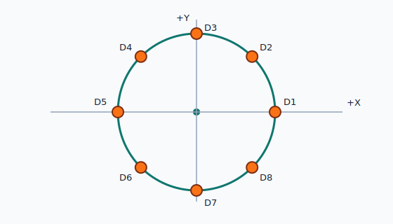

# PCB Radial Placer

PCB Radial Placer is a static TypeScript web app for calculating component
coordinates in circular and radial PCB layouts. It is meant for ECAD planning
workflows such as LED rings, switch rings, rotary controls, sensor arrays, and
other repeated radial placements.



The MVP exports coordinate tables. It does not edit KiCad board files or any
other native ECAD design file.

## Features

- Count, radius, center, start angle, direction, angle mode, unit, precision,
  and coordinate-system inputs.
- Full-circle, custom-step, and arc placement modes.
- Reference designator generation with prefix, start number, and padding.
- Fixed, radial inward/outward, tangent, and simple formula rotation modes.
- Live SVG preview with axes, labels, board-outline radius, and SVG export.
- Placement table with CSV, TSV, and JSON export plus clipboard copy.
- Local `localStorage` presets, recent settings, JSON preset import/export, and
  reset to defaults.
- Pure TypeScript calculation core with Vitest unit tests.

## Coordinate Convention

The app keeps ECAD assumptions explicit:

- Center offset is applied as `(centerX, centerY)`.
- `0 deg` points along `+X`.
- All angles and rotations are in degrees.
- Counterclockwise direction uses a positive angular step.
- Clockwise direction uses a negative angular step.
- Mathematical Y-up mode uses:

```text
x = centerX + radius * cos(theta)
y = centerY + radius * sin(theta)
theta = startAngle + i * stepAngle
stepAngle = 360 / count
```

- Screen / ECAD Y-down mode flips the sine term:

```text
y = centerY - radius * sin(theta)
```

For arc mode, the app uses the absolute span between start and end angles, then
applies the selected direction to the step sign. If `includeEndpoint` is enabled
and `count > 1`, the step is `span / (count - 1)`; otherwise it is
`span / count`.

## Export Formats

CSV and TSV use these columns:

```csv
Ref,Index,AngleDeg,X,Y,RotationDeg,Radius,CenterX,CenterY
D1,0,0.000,10.000,0.000,0.000,10.000,0.000,0.000
```

JSON includes settings, export metadata, and placements:

```json
{
  "settings": {},
  "export": {
    "decimalPlaces": 3,
    "coordinateConvention": "0 degrees is +X; positive angles are counterclockwise; +Y is up."
  },
  "placements": [
    {
      "ref": "D1",
      "index": 0,
      "angleDeg": 0,
      "x": 10,
      "y": 0,
      "rotationDeg": 0,
      "radius": 10,
      "centerX": 0,
      "centerY": 0
    }
  ]
}
```

Displayed and exported values are rounded to the selected decimal precision.
Internal calculations remain unrounded.

## Local Development

Install dependencies:

```bash
npm install
```

Run the app:

```bash
npm run dev
```

Run tests:

```bash
npm run test:run
```

Build the static site:

```bash
npm run build
```

Preview the production build:

```bash
npm run preview
```

## GitHub Pages Deployment

The Vite config uses `base: './'`, so the generated `dist/` directory can be
served from a repository subpath on GitHub Pages.

One simple deployment flow:

```bash
npm ci
npm run test:run
npm run build
```

Then publish the contents of `dist/` with your preferred GitHub Pages workflow,
for example the official Pages artifact upload action. No backend server is
required.

## Validation Notes

The calculation core has unit coverage for:

- Cardinal full-circle points.
- Center offsets.
- Clockwise angular steps.
- Y-down coordinate conversion.
- Arc endpoint mode.
- Rotation modes.
- Export rounding without mutating internal calculations.
- Basic validation errors and warnings.

Geometry validation in this MVP is numeric. The tool warns about likely duplicate
coordinates and very small adjacent chord lengths, but it does not inspect real
component body sizes, locked footprints, board clearances, or board boundaries.

## Limitations

- No direct `.kicad_pcb` editing.
- No import of existing board files.
- No true footprint collision checking.
- No multi-ring editing in the MVP UI.
- No backend, analytics, or network calls.
- Local presets are stored only in the current browser profile.

## Roadmap

- Multiple enabled rings in one exported table.
- KiCad-oriented placement CSV fields such as value, package, side, and rotation
  conventions.
- PNG preview export.
- Component bounding-box and clearance helpers.
- Bottom-side mirroring support.
- CSV import and point-set transforms.
- Shareable URL query settings.
- Optional PWA offline cache.
